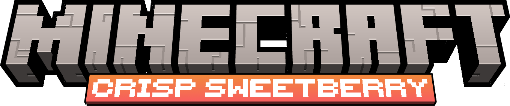

# **澄莓物语**

🌏 | [English Version](README.md)

---

## 目录

- [项目总览](#项目总览)
- [设计宗旨](#设计宗旨)
- [特性前瞻](#特性前瞻)
- [模组信息](#模组信息)
- [安装教程](#安装教程)
- 用户板块
  - [关于反馈](#关于反馈)
  - [关于我们](#关于我们)
- 开发者板块
  - [开源许可证](#开源许可证)
  - [贡献前言](#贡献前言)
  
---

## 项目总览

> **澄莓物语**(**Crisp Sweetberry**) 是一个**聚焦原版QoL**(游戏体验优化)的我的世界模组，旨在以**最微小的风格入侵**来增强和扩展探索、战斗、自动化和建筑的游戏体验.

*澄莓物语力争做到和原版向模组的高兼容度. 将澄莓物语和原版的改动了核心机制和游戏进程的模组搭配在一起使用可能会导致超出预期的行为.*

*此模组目前仍在开发中.*

---

## 设计宗旨

澄莓物语**力争**做到:

- 原版友好
- 机制符合玩家直觉
- 通过游戏流程来发现机制

澄莓物语**拒绝**去做:

- 用全新的机制覆盖原版
- 大规模改变世界生成或者群系生成
- 强制玩家阅读外部wiki来理解的基础机制

---

## 特性前瞻

澄莓物语主要关注以下方面:

- 探索和生存体验的改进
- 集成在贴合原版设计的实用物品
- 微妙的战斗和进展扩展
- 鼓励探索而非强制学习的可选系统

---

## 模组信息

澄莓物语目前仅适用于我的世界**1.21.1**的**NeoForge**模组加载器. 大版本的升级将伴随着**一系列新特性，以及一个相应的主题**, 就像官方的我的世界更新一样.
如果某些**扩展性强的特性**足够受欢迎，我们会考虑把它们拆分成一些独立的库模组.

---

## 安装教程

1. 下载适用于 **Minecraft 1.21.1** 的 **NeoForge** 模组加载器, 你可以访问NeoForge的官方开始文档, 其中包含详细的安装步骤, 请访问[**此链接**](https://docs.neoforged.net/user/docs/).
2. 从我们的发布页面或CurseForge、Modrinth下载 **Crisp Sweetberry** 模组文件.
3. 把**澄莓物语**的模组文件放入你自己的安装过**NeoForge**的我的世界的 **`mods`** 文件夹中.
4. **现在你可以开始玩了! 享受澄莓物语的乐趣吧!**

---

## 关于反馈

澄莓物语非常重视玩家的反馈, 如果你有设计方面的想法, 我们很乐意在Discord中听到你的声音! 如果你遇到了游戏崩溃或者任何运行问题, 请你在**Issue**页面提出你的问题, 并附上你的我的世界日志文件以便我们更好地帮助你解决这些问题. **我们对位置不恰当的反馈**不会进行处理, 对**信息不足的反馈**爱莫能助, 所以请你确保你的反馈在合适的位置, 并尽可能详尽且准确!

点击[这里](PLACEHOLDER)来加入我们的Discord服务器!

点击[这里](PLACEHOLDER)来进行游戏反馈!

---

## 关于我们

以下是澄莓物语的贡献者们, 每个人都是我们社区的重要成员!

*占位符 UwU*

---

## 开源许可证

本项目采用 **GNU Lesser General Public License v3.0** (LGPLv3) 开源协议。

- 你可以自由地使用、研究和分享本模组。
- 你可以开发基于本模组的扩展或插件（作为库调用），而无需强制开放你私有代码的源代码，只要你不修改 "澄莓物语" 本身的核心代码。
- 如果你修改并重新发布了 "澄莓物语" 的源代码，那么这些修改必须同样以 LGPLv3 协议开源。

有关完整的许可证文本，请参阅仓库中的 [LICENSE](LICENSE.txt) 文件。

---

## 贡献前言

澄莓物语目前仍处于早期开发阶段, 在首个正式版本发布之前, 我们暂不接受贡献, 但非常欢迎讨论、建议和设计层面的交流.

关于贡献的基本态度:

- 澄莓物语是一个**重设计理念与可维护性**的项目
- 我们不追求"**快**"，也不追求"**堆功能**"
- **我们在模组的末期内容实现前不会考虑对Fabric模组加载器的支持**, *但如果你有相关经验并且愿意贡献, 你可以直接fork这个项目并开始你的工作.*
- 所有合并进主分支的代码, 都应当:
  - 易于理解
  - 易于维护
  - 对新接触模组开发的人友好
- 我们同样接受**美术**和**语言翻译**的贡献, **每一份, 每一种贡献都值得尊敬**.

如果你认同这些原则，那么不论能力如何, 你已经非常适合参与澄莓物语的开发了.
如果你确实有兴趣, 你可以进一步了解我们的[贡献指南](CONTRIBUTING_CHN.md).
