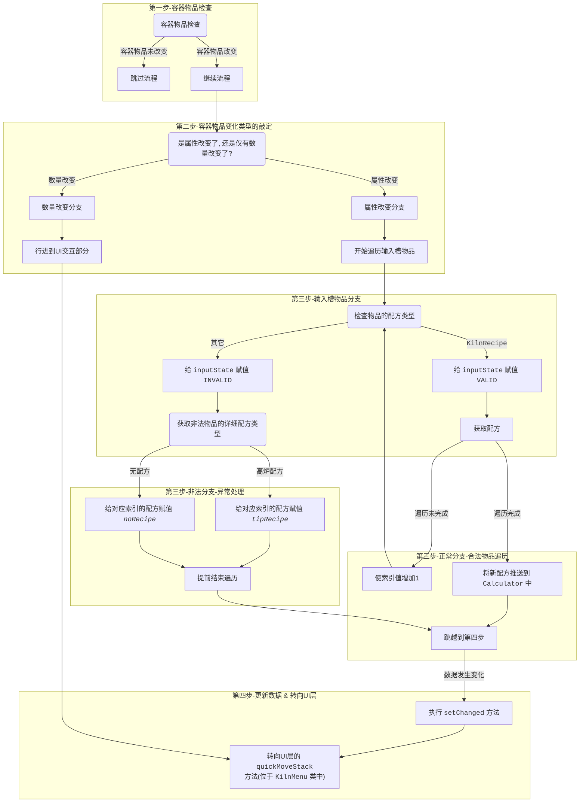
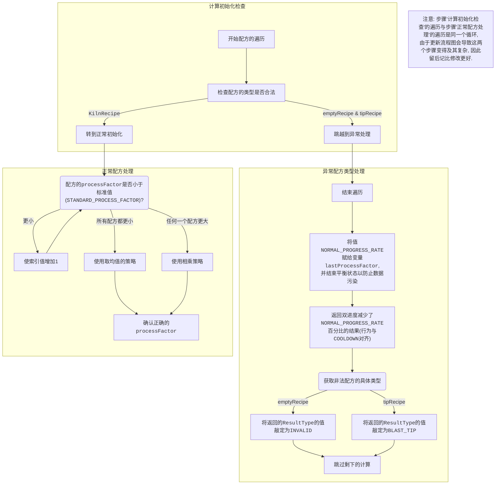
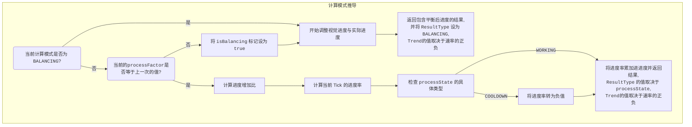
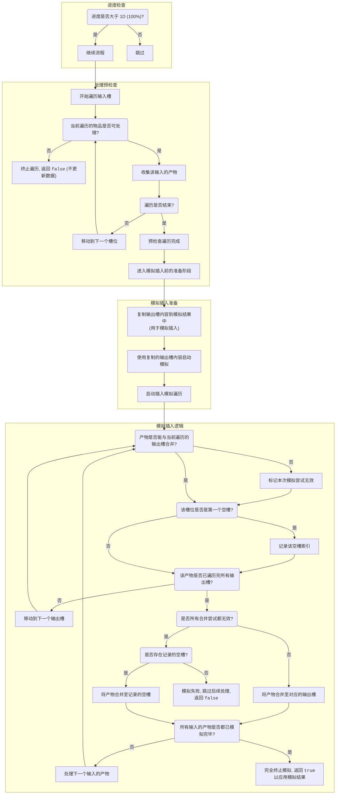

# 窑炉流程图

🌏 | [English Version](Kiln-Flowmap.md)

## 介绍

本文档由Kurv撰写, 通过把窑炉本身复杂的运作机制拆分成两大板块, 并可视化来解释窑炉的实现原理.

***在你完全理解窑炉的运作原理之前, 我们不建议修改任何窑炉相关的代码, 即使那一部分看着很简单.***

---

## 窑炉容器物品处理流程图

*注意: 如果还你没有在你的IDE里安装 `Mermaid` 插件, 你也可以在[这里](Kiln-InputCheck-Flowmap-CHN.svg)预览流程图.*

***我们并不保证图片版总是最新的.***

*如果你想进一步了解UI([KilnMenu](../client/ui/KilnMenu.java))的行为, 请自行去了解实现细节*.

---

## 窑炉总处理处理流程图

**窑炉本身通过组件化的方式实现, 其中 <u>[`KilnProgressModel`](../blockstates/components/KilnProgressModel.java)</u> 负责记录进度, 而 <u>[`KilnProgressCalculator`](../blockstates/components/KilnProgressCalculator.java)</u> 则只关心逻辑计算.**

关于**全流程总览**的大纲, 请自行翻阅<u>[`KilnBlockEntity#serverTick`](../blockstates/KilnBlockEntity.java)</u>以了解. `serverTick` 本身已经足够清晰, 无需流程图.

此外, **<u>[状态推导(`#deduceProcessState`)](../blockstates/KilnBlockEntity.java)</u> 也不会有介绍**, 该方法相当直观, 同样无需介绍.

### 进度计算

*提示:*
*本流程隶属于 <u>[`KilnProgressCalculator#clculateRates`](../blockstates/components/KilnProgressCalculator.java)</u> 方法.*

#### 初始化

#### 计算

### 产物产出处理

进度更新之前的处理部分比较直观, 此处不再赘述.

