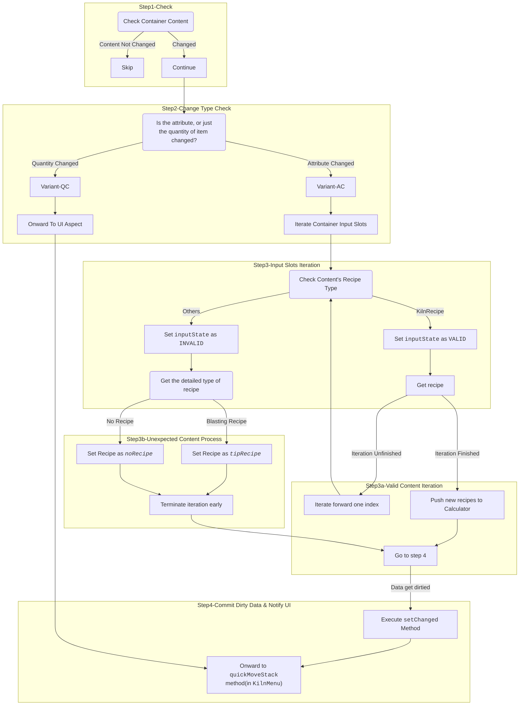
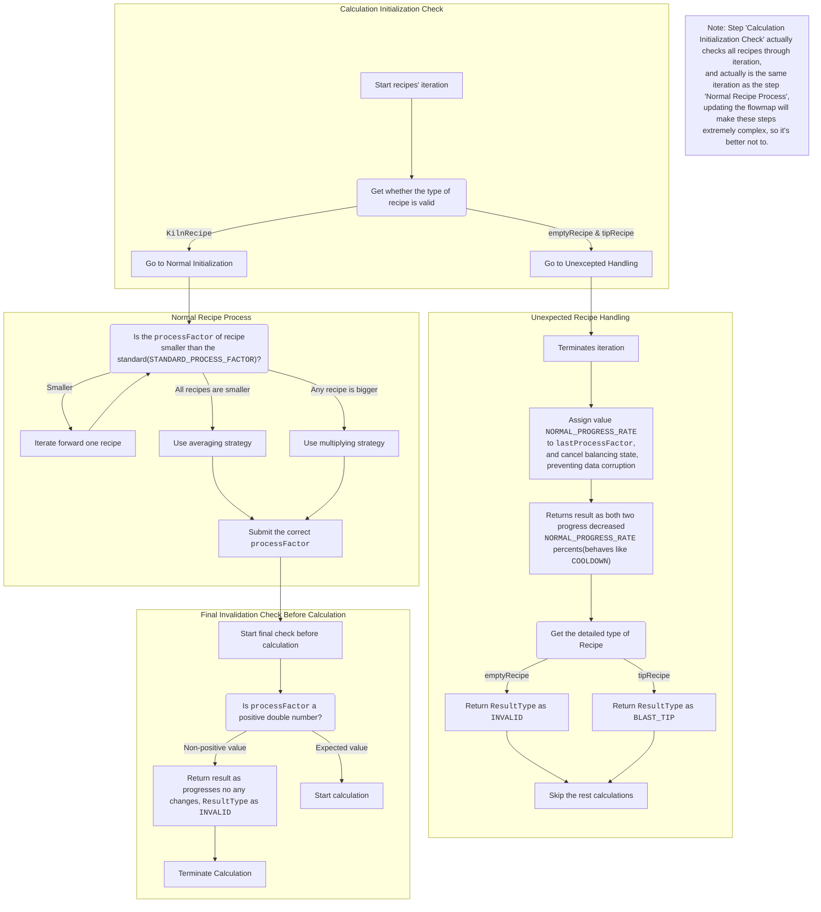
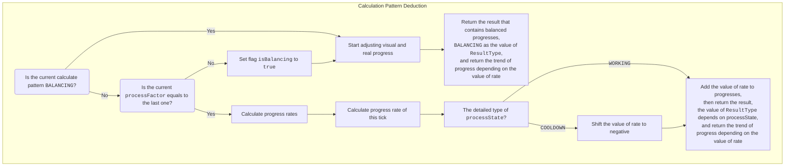

# Kiln Flowmap

🌏 | [中文文档](Kiln-Flowmap-CHN.md)

## Introduction

This is a simple document written by Kurv, which explains kiln's complex mechanic that can be sliced into two independent parts.

***It's strongly recommend not to edit the code of kiln unless you completely figured it out.***

---

## Kiln Container Content Handle Flowmap

*NOTE: If you haven't installed `Mermaid`, you can also see the image version at [here](Kiln-InputCheck-Flowmap.svg).*

***We can't guarantee that images are always up-to-date.***

*For UI([KilnMenu](../client/ui/KilnMenu.java))'s behavior, please go to go see the detailed implementation*.

---

## Standard Operating Procedures Flowmaps

**Kiln is implemented in a component way, where the model is responsible for recording progress, while the calculator only cares about logical operations.**

About **Overall Process Demonstration**, please go to <u>[`KilnBlockEntity#serverTick`](../blockstates/KilnBlockEntity.java)</u> to see details.
`serverTick` itself acts as a linear scheduler that invokes the following SOPs in order.

Also, **<u>[state deduction(`#deduceProcessState`)](../blockstates/KilnBlockEntity.java)</u> also won't get covered**. It's quite straightforward and not complex at all.

### Progress Calculation

*TIP:*
*This step is executed by <u>[`KilnProgressCalculator#calculateRates`](../blockstates/components/KilnProgressCalculator.java)</u>.*

#### Initialization

#### Calculation

### Completed Procession Handling

The part which is before the upgrade of progresses also won't get covered, as they are easy to understand.

```mermaid
graph TD;
    subgraph Progress Check 
        %% Declaration
        Check("Is progress bigger than 1D(100%)?");
        
        %% Flows
        Check --> |Yes| Continue;
        Check --> |No| Skip;
    end
    
    subgraph Procession Pre-Check 
        %% Declaration
        Iteration-Start["Start input slots' iteration"];
        
        %% This is logically unnecessary, but still kept for extreme cases.
        Iteration-Check("Is the input that being iterated processable?");
        Iteration-Invalid["Terminate iteration, return <code>false</code> as data upgrade flag"];
        Iteration-Valid-Process["Collect the result item of this input"];
        Iteration-Valid-Choice("Is the iteration ended?");
        Iteration-Continue["Iterate one slot forward"];
        Iteration-Finished["Finish iteration check"];
        To-Emu-Preparation["Go to the preparations before insert emulation"];
        
        %% Flows
        Continue --> Iteration-Start --> Iteration-Check;
        
        Iteration-Check --> |No| Iteration-Invalid;
        Iteration-Check --> |Yes| Iteration-Valid-Process --> Iteration-Valid-Choice;
        
        Iteration-Valid-Choice --> |No| Iteration-Continue --> Iteration-Check;
        Iteration-Valid-Choice --> |Yes| Iteration-Finished;
    end
    
    Iteration-Finished --> To-Emu-Preparation;
    
    subgraph Insert Emulate Preparation
    %% Declaration
        Copy-Output-Slots["Copy the content of output slots<br>to emulate result"];
        Start-Emulation["Start emulation with copy slots"];
        Emu-Iteration-Start["Start an iteration to emulate insertion"];
        
        %% Flows
        To-Emu-Preparation --> Copy-Output-Slots --> Start-Emulation --> Emu-Iteration-Start;
    end
    
    subgraph Insert Emulation 
        %% Declaration
        Emu-Check("Is the result of input can be merged<br>with the output slot that being iterated?");
        Emu-Empty-Check("Is this output slot the<br>first output slot that is empty?");
        Emu-Empty-Yes["Record the index of this output slot"];
        Emu-Invalid-Attempt["Count this attempt of emulation as invalid"];
        Emu-Slot-Forward["Iterate one output slot forward"];
        Emu-Iteration-Check("Does this input have iterated all output slots?");
        Emu-Iteration-Finish-Variant("Are all attempts invalid?");
        Emu-Iteration-Finish-Invalid-Variant("Is there exists a recorded empty output slot?");
        Emu-Iteration-Finish-Invalid-Expected["Merge the result to the recorded slot"];
        Emu-Iteration-Finish-Valid-Merge["Merge the result of input to corresponded output slot"];
        Emu-Failed["Emulation finished with failed result,<br>skip the rest handling, and returning <code>false</code> as return value"];
        Emu-Iteration-End-Check("Is all result of input emulated?");
        Emu-Iteration-Forward["Iterate one result of input forward"];
        Emu-Iteration-End["Fully terminate the emulation, returning<br><code>true</code> to apply the emulated result"];
        
        %% Flows
        Emu-Iteration-Start --> Emu-Check;
        
        Emu-Check --> |False| Emu-Invalid-Attempt --> Emu-Empty-Check;
        Emu-Check --> |True| Emu-Empty-Check;
        
        Emu-Empty-Check --> |Yes| Emu-Empty-Yes --> Emu-Iteration-Check;
        Emu-Empty-Check --> |No| Emu-Iteration-Check;
        
        Emu-Iteration-Check --> |No| Emu-Slot-Forward --> Emu-Check;
        Emu-Iteration-Check --> |Yes| Emu-Iteration-Finish-Variant;
        
        Emu-Iteration-Finish-Variant --> |No| Emu-Iteration-Finish-Valid-Merge --> Emu-Iteration-End-Check;
        Emu-Iteration-Finish-Variant --> |Yes| Emu-Iteration-Finish-Invalid-Variant;
        
        Emu-Iteration-Finish-Invalid-Variant --> |Yes| Emu-Iteration-Finish-Invalid-Expected --> Emu-Iteration-End-Check;
        Emu-Iteration-Finish-Invalid-Variant --> |No| Emu-Failed;
        
        Emu-Iteration-End-Check --> |No| Emu-Iteration-Forward --> Emu-Check;
        Emu-Iteration-End-Check --> |Yes| Emu-Iteration-End;
    end
```

